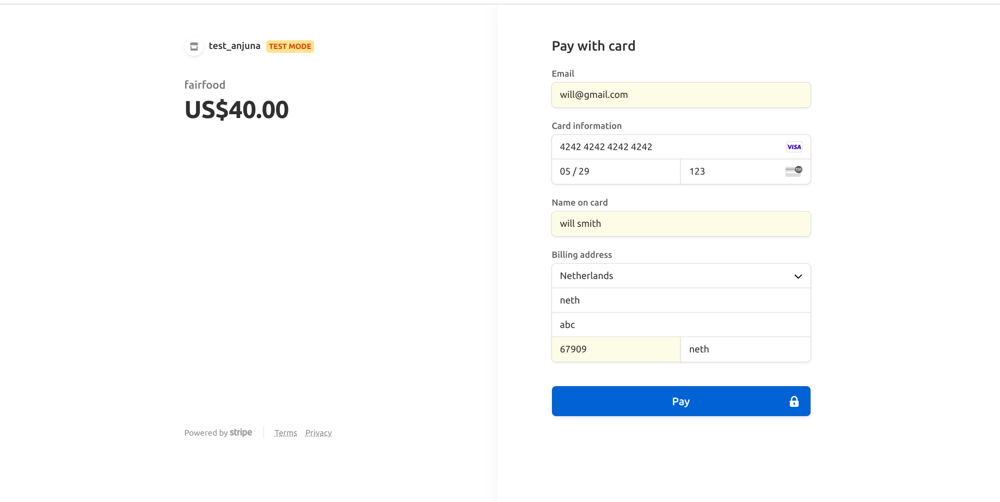

# payment system 

To create a
link for payment of the invoices they sent to different customers.

## Prerequisites
* Python 4.0.4
* Postgres 10.19
* virtualenv

## Payment pages



## Setup instructions 
* Update your system using the command :
```sh
  sudo apt update
```  
* Install essentials given below:
```sh
  sudo apt install python3-pip
  sudo apt install git
```

* Create virtualenv and activate
```sh
  sudo pip install mkvirtualenv payment_system
```

* Install Postgres and related libraries:
```sh
* sudo apt-get install postgresql postgresql-contrib libpq-dev gdal-bin postgis
```
* Create the database user and the database:

First, switch to the postgres system user account and run the psql command as follows:

```sh
$ sudo su - postgres
$ psql
postgres=# 
```
Now create a new database and a user using the following commands.

```sh
postgres=# CREATE USER payment_system WITH PASSWORD 'payment_system';
postgres=# CREATE DATABASE payment_system;
postgres=# GRANT ALL PRIVILEGES ON DATABASE payment_system to payment_system;
postgres=# \q
```

* Installing pgAdmin4
```sh
  * curl https://www.pgadmin.org/static/packages_pgadmin_org.pub
  * sudo sh -c 'echo "deb https://ftp.postgresql.org/pub/pgadmin/pgadmin4/apt/$(lsb_release -cs) pgadmin4 main" > /etc/apt/sources.list.d/pgadmin4.list && apt update'
  * sudo apt install pgadmin4
```

* Install requirements
```sh
$ pip install requirements.txt
```    
If there is an error occur when install pillow library. Then install pillow as:
```sh
python3 -m pip install Pillow
```
After that complete the requirement installation.

